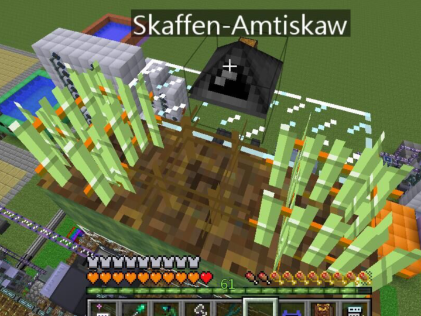

# GTNH-IC2Hybrid
使用openComputer完成ic2的作物自动杂交、育种、繁殖

先组装一台机器人,需要以下材料:

- T1内存条
- 地质分析仪(放机器人组件里)
- 硬盘
- 键盘
- 显示屏
- 物品升级
- 物品交互升级
- 逻辑处理器
- 基础显卡
- 软盘驱动器(如果你的硬盘里已经装好openOS则不需要)

# 机器人摆放 

按照以下方式摆放

|  作物架  | 耕地       | 作物架 |
| :------: | ---------- | ------ |
|   方块   | 机器人     | 方块   |
| 任意方块 | 作物架箱子 | 垃圾桶 |



## 代码使用

将lua文件放入 **{存档/服务器World}**/opencomputer/**{硬盘id}**/home/  目录下

开机机器人并执行

```shell
excution
```

随后跟随指引即可


# 育种

需提交在左右作物架放置好作物(**其中一边放高属性的树脂甘蔗，另外一边放你要育种的植物**)，启动程序输入要育种的植物名

例如啤酒花(hops)、树脂甘蔗(stickreed)，随后机器人会自动进行加权平均值计算种子的属性并替换左右的植物

默认的权重为**50%(产量), 35%(生长速度), 15%(抗性)**,当杂交出生长速度>**23**的种子时会直接进行丢弃
